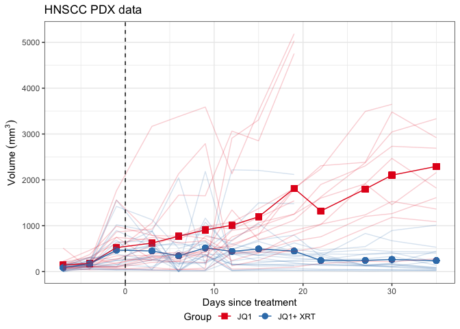
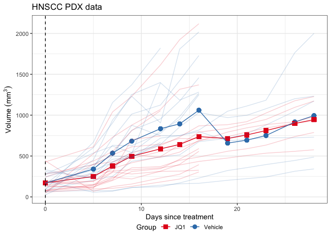

Tools for Hierarchical and Prioritized Estimators in Tumor Growth
Studies
================
Colin Longhurst
Last Modified: 03 December, 2025

- [Independent Data](#independent-data)
  - [Function Details](#function-details)
  - [Example 1](#example-1)
  - [Example 2](#example-2)
- [Clustered Data](#clustered-data)
  - [Function Details](#function-details-1)
  - [Example 1](#example-1-1)
  - [Example 2](#example-2-1)
- [A Generic Variance Estimator for the Win
  Ratio](#a-generic-variance-estimator-for-the-win-ratio)
  - [Example with independent data](#example-with-independent-data)
  - [Clustered Data](#clustered-data-1)

This repository contains R scripts to calculate the hierarchical and
prioritized estimators described in:

Longhurst, C, Iyer, G, Yu, M (2025). *A Unified Testing Framework in
Preclincial Tumor Growth Studies using Prioritized Endpoints*.

First, we load some necessary packages and source all the script files:

``` r
library(tidyverse)
library(magrittr)
library(MESS) # to calculate AUC

source("R/hpc_independent.R") # for independent data
source("R/hpc_clustered.R") # for clustered data
source("R/aux_clustered_kappa.R") # utility function
source("R/aux_clustered_wr.R") # flexible function to estimate win ratio variance
```

# Independent Data

As an example, consider the left-tumor only data of Figure 1 from the
main paper.

``` r
ex1_ind <- read.csv("data/scc_148_indep.csv")

# baseline is first available measurement
# in this case 1 day before trt is administered
ex1_ind %<>%
  filter(Day >= -1) %>% 
  group_by(ID) %>% 
  mutate(Baseline = Volume[1]) 
```

The data is longitudinal, and includes data on day of animal sacrifice:

``` r
ex1_ind %>% # example data for mouse 977
  filter(.,Mouse == "977") %>% 
  knitr::kable()
```

| Group | Mouse | Tumor | ID    | Day |     Volume | death | last_day_obs | sac_day | Baseline |
|:------|:------|:------|:------|----:|-----------:|------:|-------------:|--------:|---------:|
| JQ1   | 977   | L     | 977:L |  -1 |   53.92348 |     1 |           19 |      22 | 53.92348 |
| JQ1   | 977   | L     | 977:L |   3 |   85.99753 |     1 |           19 |      22 | 53.92348 |
| JQ1   | 977   | L     | 977:L |   6 |   43.68432 |     1 |           19 |      22 | 53.92348 |
| JQ1   | 977   | L     | 977:L |   9 |   77.95241 |     1 |           19 |      22 | 53.92348 |
| JQ1   | 977   | L     | 977:L |  12 | 2909.68216 |     1 |           19 |      22 | 53.92348 |
| JQ1   | 977   | L     | 977:L |  15 | 3308.30362 |     1 |           19 |      22 | 53.92348 |
| JQ1   | 977   | L     | 977:L |  19 | 5032.76098 |     1 |           19 |      22 | 53.92348 |
| JQ1   | 977   | L     | 977:L |  22 |         NA |     1 |           19 |      22 | 53.92348 |
| JQ1   | 977   | L     | 977:L |  27 |         NA |     1 |           19 |      22 | 53.92348 |
| JQ1   | 977   | L     | 977:L |  30 |         NA |     1 |           19 |      22 | 53.92348 |
| JQ1   | 977   | L     | 977:L |  35 |         NA |     1 |           19 |      22 | 53.92348 |

## Function Details

To analyze the data using our proposed estimator, we can use the
`hpc_independent()` function. The function takes in a dataframe in the
form seen above, calculates the univariate expression of the
hierarchical and prioritized estimator described in the paper and
returns several summary statistics such as confidence intervals,
p-values and a win/loss summary matrix. The arguments are as follows:

- `df`: Long-format data frame containing all required columns (group,
  mouse, day, volume, baseline, death, sacrifice day); one row per
  mouse–day.
- `group_col = "Group"`: Name of the treatment-group column (character
  or factor) used to define treatment arms.
- `mouse_col = "Mouse"`: Unique mouse identifier column;
  resampling/cluster logic treats this as the unit.
- `day_col = "Day"`: Measurement day/time column used to order points
  and compute sAUC.
- `vol_col = "Volume"`: Tumor volume column; used to compute scaled AUC
  (volume/baseline).
- `baseline_col = "Baseline"`: Positive baseline volume per mouse;
  scaling divisor for sAUC (must be \> 0). For an unscaled analysis,
  simply set this value to 1 for each row in the data frame.  
- `death_col = "death"`: Death indicator (1 = died/sacrificed, 0 =
  survived); used in the calculation of Q.
- `sac_day_col = "sac_day"`: Day of death/euthanasia when death == 1,
  otherwise NA; used as the terminal time for sAUC.
- `trt_label = "Treatment"`: Label in group_col that identifies the
  treatment arm.
- `ctl_label = "Control"`: Label in group_col that identifies the
  control/comparator arm.
- `estimator_type = c("kappa","win ratio")`: Target estimand—either the
  probability of win κ = P(X\>Y) or the win ratio κ/(1-κ).
- `p_val_type = c("exact","asymptotic")`: Wilcoxon–Mann–Whitney p-value
  on the composite Q; exact uses permutation logic when feasible,
  asymptotic uses the large-sample approximation.
- `comparison_details = FALSE`: If TRUE, returns a per-pair grid with
  win/loss/tie and rule (death priority (one animal dies, one does not),
  death time (both animals die, one sooner than the other), sAUC at
  equal time), as well as component counts.
- `study_end_day = NULL`: Optional fixed study end T; if NULL, inferred
  from the maximum day among survivors (fallback to max observed day).
- `conf_level = 0.95`: Confidence level for intervals (applies to both
  asymptotic and bootstrap methods).
- `ci_method` = c(“asymptotic”,“percentile”): If `"asymptotic"` the CI
  is calculated via the influence function approach described in the
  main paper, if `"percentile"` a percentile bootstrap is returned where
  the re-sampling of clusters (animals) is within treatment arm.
- `correct` = c(“none”,“CR1”,“CR1s”): Optional small-sample correction
  for asymptotic CIs/SEs. If `"CR1"`, c = N/N-1, if `"CR1s"`, c =
  (N/N-1)(G-1/G-k), where N is the number of clusters (animals), G is
  the number of tumors (in the independent case, G = N) and k is the
  number of parameters estimated (k = 2 here). Both use a t-reference
  distribution with N-1 degrees of freedom.
- `nBoot = 2000`: Number of bootstrap replicates when ci_method =
  “percentile” (ignored otherwise).
- `seed = NULL`: Optional RNG seed for reproducible bootstrap resamples.

## Example 1

To re-create the results in Section 4 of the main paper, we run:

``` r
ex1_indep_results <- hpc_independent(df = ex1_ind,
                       group_col    = "Group",
                       mouse_col    = "Mouse",
                       day_col      = "Day",
                       vol_col      = "Volume",
                       baseline_col = "Baseline",
                       death_col    = "death",     
                       sac_day_col  = "sac_day",   
                       ctl_label    = "JQ1",
                       trt_label    = "JQ1+ XRT",
                       p_val_type = "exact",
                       comparison_details = TRUE,
                       ci_method = "percentile",
                       nBoot = 500,
                       seed = 123,
                       correct = 'none'
)
```

From the object, we can pull the statistics of interest, including
estimates, p-values and various win summaries:

``` r
data.frame(
  "P(X>Y)" = ex1_indep_results$estimate,
  "p-value (exact)" = ex1_indep_results$p_value_wilcox_Q,
  "# trt wins" = ex1_indep_results$comparison_details$n_wins,
  "# wins on death"= ex1_indep_results$comparison_details$n_trt_wins_on_death,
  "# wins on sAUC"= ex1_indep_results$comparison_details$n_trt_wins_on_sAUC,
  check.names = FALSE
) %>% knitr::kable()
```

|   P(X\>Y) | p-value (exact) | \# trt wins | \# wins on death | \# wins on sAUC |
|----------:|----------------:|------------:|-----------------:|----------------:|
| 0.7666667 |       0.0534759 |          69 |               34 |              35 |

A table with the calculated *Q* values can be pulled:

``` r
ex1_indep_results$Q_table %>% 
  data.frame() %>% 
  head() %>% 
  knitr::kable(.)
```

| Mouse      | Group    | death | sac_day | last_day |       sAUC |         Q |
|:-----------|:---------|------:|--------:|---------:|-----------:|----------:|
| 847        | JQ1+ XRT |     1 |      22 |       22 |  36.442151 | 22.027441 |
| 848        | JQ1+ XRT |     1 |      22 |       22 |   8.437282 | 22.118522 |
| 934 (dead) | JQ1      |     1 |       6 |        6 |   3.827126 |  6.261293 |
| 935        | JQ1      |     0 |      NA |       35 | 226.162694 | 36.004422 |
| 936        | JQ1      |     1 |      22 |       22 |  20.245297 | 22.049394 |
| 952        | JQ1      |     1 |      22 |       22 |  50.423666 | 22.019832 |

as well as a grid that contains the results from all pairwise
comparisons:

``` r
ex1_indep_results$pairs %>% 
  select(t_mouse,c_mouse,rule, score) %>% 
  head() %>% 
  knitr::kable(.)
```

| t_mouse | c_mouse    | rule            | score |
|:--------|:-----------|:----------------|------:|
| 847     | 934 (dead) | death_time      |     1 |
| 847     | 935        | death_priority  |    -1 |
| 847     | 936        | sAUC_equal_time |    -1 |
| 847     | 952        | sAUC_equal_time |     1 |
| 847     | 958        | death_priority  |    -1 |
| 847     | 961        | death_priority  |    -1 |

The values of the `rule` column are as follows:

- `death_priority`: One mouse died and the other survived; the survivor
  wins (no sAUC used).
- `death_time`: Both died, but on different days; the one that died
  later wins (no sAUC used).
- `sAUC_equal_time`: Death status and terminal time are the same (both
  died the same day or both survived to T), so the lower sAUC wins.

## Example 2

The example seen in Web Appendix E can be replicated via the following
code:

``` r
ex2_indep <- read.csv("data/indep_scc47.csv")

# these results are in Web Table 5 - Appendix E
ex2_results <- hpc_independent(ex2_indep,
                       estimator_type = "win ratio",
                       p_val_type = "exact",
                       ctl_label = "Vehicle",
                       trt_label = "JQ1",
                       comparison_details = TRUE,
                       ci_method = "asymptotic",
                       correct = 'none'
)
```

And the results:

``` r
data.frame(
  "Win Ratio" = ex2_results$estimate,
  "p-value (exact)" = round(ex2_results$p_value_wilcox_Q,4),
  "95% CI" = paste0("(",round(ex2_results$conf_int[[1]],3),",",round(ex2_results$conf_int[[2]],3),")"),
  check.names = FALSE
) %>% knitr::kable()
```

| Win Ratio | p-value (exact) | 95% CI        |
|----------:|----------------:|:--------------|
|      1.56 |          0.5054 | (0.437,5.566) |

# Clustered Data

We now re-visit the data used in Figure 1 from the main paper:

``` r
ex1_cluster <- read.csv("data/scc_148_clust.csv")
```

<!-- -->

To analyze all tumors clustered within mouse, we use the
`hpc_clustered()` function.

## Function Details

The arguments are similar to `hpc_independent()`, with a few additions:

- `df`: Long-format data frame with one row per tumor–day; must include
  tumor ID, cluster (mouse) ID, group, day, volume, baseline, death, and
  last-observed day.
- `tumor_id_col = "ID"`: Name of the column giving a unique tumor
  identifier (e.g., “401:R”, “401:L”).
- `cluster_id_col = "Mouse"`: Name of the column for the clustering unit
  (animal ID); used for cluster-robust variance and small-sample
  corrections.
- `group_col = "Group"`: Name of the treatment-group column (character
  or factor) used to define treatment arms.
- `day_col = "Day"`: Name of the column encoding the numeric observation
  day/time; used to order measurements and compute cumulative sAUC.
- `vol_col = "Volume"`: Name of the column encoding the longitudinal
  volume measurements.
- `baseline_col = "Baseline"`: Positive baseline volume per tumor. If
  you don’t wish to scale, set this value to 1 for each tumor.
- `death_col = "death"`: Indicator (1 = death/sacrifice/event, 0 =
  censored/none).
- `last_col = "last_day_obs"`: Final observed day for the tumor. This is
  one time-unit prior to death/sacrifice day.
- `trt_label = "Treatment"`: Value in group_col identifying the
  treatment arm.
- `ctl_label = "Control"`: Value in group_col identifying the
  control/comparator arm.
- `conf_level = 0.95`: Confidence level for cluster-robust CIs on the
  win ratio.
- `correct = c("none","CR1","CR1s")`: Optional small-sample correction
  for cluster robust CIs/SEs. If `"CR1"`, c = N/N-1, if `"CR1s"`, c =
  (N/N-1)(M-1/M-k), where N is the number of clusters (animals), M is
  the number of tumors (in the bilateral case, M = 2N) and k is the
  number of parameters estimated (k = 2 here). Both use a t-reference
  distribution with N-1 degrees of freedom.
- `tol = 1e-12`: Numeric tolerance for internal use.

## Example 1

We now analyze the clustered data to replicate the results found in
Section 4 of the main paper:

``` r
# first we create our baseline variable
ex1_cluster %<>% 
  filter(Day >= -1) %>% 
  group_by(ID) %>% 
  mutate(Baseline = Volume[1]) 

ex1_clust_res <- hpc_clustered(df = ex1_cluster,
         tumor_id_col   = "ID",        
         cluster_id_col = "Mouse",     
         group_col      = "Group",     
         day_col        = "Day",       
         vol_col        = "Volume",   
         baseline_col   = "Baseline",  
         death_col      = "death",     
         last_col       = "last_day_obs", 
         trt_label      = "JQ1+ XRT",
         ctl_label      = "JQ1",
         conf_level     = 0.95,
         correct        = "CR1") # with small sample correction
```

We can pull the statistics of interest from the object created above to
replicate the values found in the main paper:

``` r
data.frame(
  "Win Ratio" = ex1_clust_res$win_ratio,
  "p-value" = round(ex1_clust_res$p_value,4),
  "95% CI" = paste0("(",round(ex1_clust_res$ci[[1]],3),",",round(ex1_clust_res$ci[[2]],3),")"),
  check.names = FALSE
) %>% knitr::kable()
```

| Win Ratio | p-value | 95% CI        |
|----------:|--------:|:--------------|
|  2.829787 |  0.0033 | (1.485,5.393) |

We can also pull win statistics:

``` r
data.frame(
    "# trt wins" = ex1_clust_res$counts$n_wins, # number of wins
  "# wins on death"= ex1_clust_res$counts$n_trt_wins_on_death, # number of wins on death
  "# wins on sAUC"= ex1_clust_res$counts$n_trt_wins_on_sAUC_d, # number of wins on death
check.names = F
  ) %>% knitr::kable()
```

| \# trt wins | \# wins on death | \# wins on sAUC |
|------------:|-----------------:|----------------:|
|         266 |               74 |             192 |

as well as the matrix of pairwise comparison results. Reviewing this
matrix is a good way to ensure the algorithm is processing the data as
expected:

``` r
ex1_clust_res$pairs %>% 
  select(treat_id,control_id,rule,score) %>% 
  head() %>% knitr::kable()
```

| treat_id | control_id   | rule                    | score |
|:---------|:-------------|:------------------------|------:|
| 847:L    | 934 (dead):L | death_time              |     1 |
| 847:L    | 934 (dead):R | sAUC_common_maxobs      |    -1 |
| 847:L    | 935:L        | death_vs_censor_decided |    -1 |
| 847:L    | 935:R        | death_vs_censor_decided |    -1 |
| 847:L    | 936:L        | death_vs_censor_decided |    -1 |
| 847:L    | 936:R        | sAUC_equal_time         |    -1 |

The four primary values of the `rule` column correspond to:

- `death_time`: Both tumors died; winner is the one that died later.
- `death_vs_censor_decided`: One died, the other was censored after that
  death time; the censored tumor wins on survival.
- `sAUC_equal_time`: Death status matches and time horizons are equal
  (same death day or same censor day); winner is lower sAUC at that
  time.
- `sAUC_common_maxobs`: When time horizons differ (e.g. death vs. censor
  where censor time ≤ death time), compare sAUC at the largest day
  observed in both tumors; lower sAUC wins.

Other values are possible, but unlikely (`tie_equal_time`,
`tie_common_maxobs`, `sAUC_equal_time_na`, `sAUC_common_maxobs_na`,
`indeterminate`).

## Example 2

Now we re-create Web Figure 4 from Web Appendix E:

``` r
ex2_cluster <- read.csv("data/clust_scc47.csv")
```

<!-- -->

And use the function described above to replicate the results:

``` r
ex2_clust_results <- hpc_clustered(df = ex2_cluster,
                     tumor_id_col   = "ID",       
                     cluster_id_col = "Mouse",     
                     group_col      = "Group",     
                     day_col        = "Day",       
                     vol_col        = "Volume",   
                     baseline_col   = "Baseline",  
                     death_col      = "death",     
                     last_col       = "last_day_obs", 
                     trt_label      = "JQ1",
                     ctl_label      = "Vehicle",
                     conf_level     = 0.95,
                     correct        = "none")
```

``` r
data.frame(
  "Win Ratio" = ex2_clust_results$win_ratio,
  "p-value" = round(ex2_clust_results$p_value,4),
  "95% CI" = paste0("(",round(ex2_clust_results$ci[[1]],3),",",round(ex2_clust_results$ci[[2]],3),")"),
  "# trt wins" = ex2_clust_results$counts$n_wins, # number of wins
  "# wins on death"= ex2_clust_results$counts$n_trt_wins_on_death, # number of wins on death
  "# wins on sAUC"= ex2_clust_results$counts$n_trt_wins_on_sAUC_d, # number of wins on sAUC
  check.names = FALSE
) %>% knitr::kable()
```

| Win Ratio | p-value | 95% CI        | \# trt wins | \# wins on death | \# wins on sAUC |
|----------:|--------:|:--------------|------------:|-----------------:|----------------:|
|  1.115703 |  0.7004 | (0.639,1.949) |         135 |               60 |              75 |

# A Generic Variance Estimator for the Win Ratio

Many win ratio software packages are limited in their win strategy
capability, with most being written to accommodate the two time-to-event
endpoint semi-competing-risks setup. Here, we provide a generic function
to estimate the variance of the win-ratio that can easily be used
downstream of a custom, user-written win/loss function. Let $m$ be the
number of (possibly correlated) treatment units (in this case tumors)
and let $n$ be the number of (possibly correlated) control units.

The function `aux_clustered_wr()` has six arguments:

- `S1`: Integer matrix (m × n) of pairwise treatment wins (1/0) with
  rows = treated tumors, columns = control tumors.
- `S2`: Integer matrix (m × n) of pairwise treatment losses (1/0), same
  dimensions/order as S1.
- `t_clusters`: Length-m vector mapping each treated tumor row of S1/S2
  to its cluster/mouse ID (used for cluster aggregation).
- `c_clusters`: Length-n vector mapping each control tumor column of
  S1/S2 to its cluster/mouse ID (used for cluster aggregation).
- `conf_level = 0.95`: Confidence level for the win-ratio CI.
- `correct = c("none", "CR1", "CR1s")`: small-sample correction for
  cluster robust CIs/SEs. If `"CR1"`, c = N/N-1, if `"CR1s"`, c =
  (N/N-1)(G-1/G-k), where N is the number of clusters (animals), G is
  the number of tumors (in the bilateral case, G = 2N) and k is the
  number of parameters estimated (k = 2 here). Both use a t-reference
  distribution with N-1 degrees of freedom.

## Example with independent data

First we consider the case when each cluster only has one observation
(independent data). First, we generate some data with a population
probability index of $P(X > Y) = 0.75$ and known win ratio of
$\Psi =  3$:

``` r
set.seed(123)
m = 70 # trt observation/clusters
n = 75 # ctl observation/clusters
control <- rnorm(n, 0, 1)
trt  <- rnorm(m,  0.9538726, 1)
```

and double check:

``` r
mean(outer(control,trt,"<")) # close to 0.75
```

    ## [1] 0.7371429

Now we calculate all pairwise comparisons, which can be accomplished in
this example using `outer()`. In more complicated data cases, the user
needs only write a function that runs their win strategy on their data
and return a matrix of 0/1s for each pairwise comparison.

``` r
S1_ex <- outer(trt, control, `>`) # grid of trt wins, 70 x 75
S2_ex <- outer(trt, control, `<`) # grid of trt losses, 70 x 75
```

and we can define the clusters (noting that each cluster only has one
observation)

``` r
t_clusters_ex <- paste0("trt:",1:m) # trt cluster labels
c_clusters_ex <- paste0("ctl:",1:n) # ctrl cluster labels
```

and now we can use the generic function to estimate the win ratio
variance using the methods derived in the main paper:

``` r
gr_ex1 <- aux_clustered_wr(S1 = S1_ex, 
                 S2 = S2_ex, 
                 t_clusters = t_clusters_ex,
                 c_clusters = c_clusters_ex,
                conf_level = .95, 
                correct = "none")
```

And from this object we get our results along with other helpful
statistics:

``` r
data.frame(
  "Win Ratio" = gr_ex1$win_ratio,
  "SE log(WR)" = gr_ex1$se_log_wr,
  "P(X>Y)" = gr_ex1$win_prob_trt,
  "p-value" = round(gr_ex1$p_value,4),
  "95% CI" = paste0("(",round(gr_ex1$ci[[1]],3),",",round(gr_ex1$ci[[2]],3),")"),
  check.names = FALSE
) %>% knitr::kable()
```

| Win Ratio | SE log(WR) |   P(X\>Y) | p-value | 95% CI        |
|----------:|-----------:|----------:|--------:|:--------------|
|  2.804348 |  0.2111543 | 0.7371429 |       0 | (1.854,4.242) |

To verify the estimator, we can run a small simulation ensuring coverage
is correct:

``` r
variance_tester <- function(i){
  control_sim <- rnorm(n, 0, 1)
  trt_sim  <- rnorm(m,  0.9538726, 1)
  S1_sim <- outer(trt_sim, control_sim, `>`) 
  S2_sim <- outer(trt_sim, control_sim, `<`) 
  gr_sim <- aux_clustered_wr(S1 = S1_sim, 
                 S2 = S2_sim, 
                 t_clusters = t_clusters_ex,
                 c_clusters = c_clusters_ex,
                conf_level = .95, 
                correct = "none")
  result<- dplyr::between(3,gr_sim$ci[1],gr_sim$ci[2])
  return(result)
}
set.seed(5)
cov <- mean(replicate(400,variance_tester(1))) 
print(paste0("Coverage is ", cov))
```

    ## [1] "Coverage is 0.9475"

## Clustered Data

The use of the generic function with clustered data proceeds similarly
to above, with the difference being how clusters assigned. For this
example, we will generate data with 50 trt clusters, each with 3
observations, and 45 control clusters, each with 4 observations, and set
the population win ratio to $\Psi = 1.5$ with an ICC of 0.50.

``` r
set.seed(1)
n = 45 # ctrl clusters
k_ctrl = 4 # obs per ctrl cluster
ctrl_dat <-
    expand.grid(cluster = 1:n, rep = 1:k_ctrl) %>% 
  dplyr::mutate( trt = 0, id = paste0(trt,":",cluster,":",rep)) %>% 
    dplyr::group_by(cluster) %>%
    dplyr::mutate(b = rnorm(1,0,1)) %>% 
    dplyr::ungroup() %>% 
    dplyr::mutate(Y_1 = rnorm(dplyr::n(),0,1)+b) %>% 
  arrange(cluster)

m = 50 # trt clusters
k_trt = 3 # obs per trt cluster
trt_dat <-
  expand.grid(cluster = 1:m, rep = 1:k_trt) %>% 
  dplyr::mutate( trt = 1, id = paste0(trt,":",cluster,":",rep)) %>% 
  dplyr::group_by(cluster) %>%
  dplyr::mutate(b = rnorm(1,0,1)) %>% 
  dplyr::ungroup() %>% 
  dplyr::mutate(Y_1 = rnorm(dplyr::n(),mean = 0.5066942,1)+b)%>% 
  arrange(cluster)
```

``` r
emp_WR <- mean(outer(ctrl_dat$Y_1,trt_dat$Y_1,"<")) / mean(outer(ctrl_dat$Y_1,trt_dat$Y_1,">")) 
print(paste0("Observed win ratio is ", round(emp_WR,3)))
```

    ## [1] "Observed win ratio is 1.501"

We now use the generic variance estimator function:

``` r
S1_ex2 <- outer(trt_dat$Y_1, ctrl_dat$Y_1, `>`) 
S2_ex2 <- outer(trt_dat$Y_1, ctrl_dat$Y_1, `<`) 
gr_ex2 <- aux_clustered_wr(S1 = S1_ex2, 
                 S2 = S2_ex2, 
                 t_clusters = trt_dat$cluster, # cluster labels
                 c_clusters = ctrl_dat$cluster,
                conf_level = .95, 
                correct = "CR1")

data.frame(
  "Win Ratio" = gr_ex2$win_ratio,
  "SE log(WR)" = gr_ex2$se_log_wr,
  "P(X>Y)" = gr_ex2$win_prob_trt,
  "p-value" = round(gr_ex2$p_value,4),
  "95% CI" = paste0("(",round(gr_ex2$ci[[1]],3),",",round(gr_ex2$ci[[2]],3),")"),
  check.names = FALSE
) %>% knitr::kable()
```

| Win Ratio | SE log(WR) |   P(X\>Y) | p-value | 95% CI        |
|----------:|-----------:|----------:|--------:|:--------------|
|  1.500695 |  0.1871448 | 0.6001111 |  0.0326 | (1.035,2.176) |

And finally a small simulation to verify correct coverage:

``` r
clust_variance_tester <- function(i){
  m = 50 # trt clusters
k_trt = 3 # obs per trt cluster
  n = 45 # ctrl clusters
k_ctrl = 4 # obs per ctrl cluster

ctrl_dat_sim <-
    expand.grid(cluster = 1:n, rep = 1:k_ctrl) %>% 
  dplyr::mutate( trt = 0, id = paste0(trt,":",cluster,":",rep)) %>% 
    dplyr::group_by(cluster) %>%
    dplyr::mutate(b = rnorm(1,0,1)) %>% 
    dplyr::ungroup() %>% 
    dplyr::mutate(Y_1 = rnorm(dplyr::n(),0,1)+b) %>% 
  arrange(cluster)

trt_dat_sim <-
  expand.grid(cluster = 1:m, rep = 1:k_trt) %>% 
  dplyr::mutate( trt = 1, id = paste0(trt,":",cluster,":",rep)) %>% 
  dplyr::group_by(cluster) %>%
  dplyr::mutate(b = rnorm(1,0,1)) %>% 
  dplyr::ungroup() %>% 
  dplyr::mutate(Y_1 = rnorm(dplyr::n(),mean = 0.5066942,1)+b)%>% 
  arrange(cluster)

S1_sim2 <- outer(trt_dat_sim$Y_1, ctrl_dat_sim$Y_1, `>`) 
S2_sim2 <- outer(trt_dat_sim$Y_1, ctrl_dat_sim$Y_1, `<`) 

gr_sim <- aux_clustered_wr(S1 = S1_sim2, 
                 S2 = S2_sim2, 
                 t_clusters = trt_dat_sim$cluster,
                 c_clusters = ctrl_dat_sim$cluster,
                conf_level = .95, 
                correct = "CR1")
  result<- dplyr::between(1.5,gr_sim$ci[1],gr_sim$ci[2])
  return(result)
}
set.seed(2)
cov_clust <- mean(replicate(400,clust_variance_tester(1))) 
print(paste0("Coverage is ", cov_clust))
```

    ## [1] "Coverage is 0.96"
